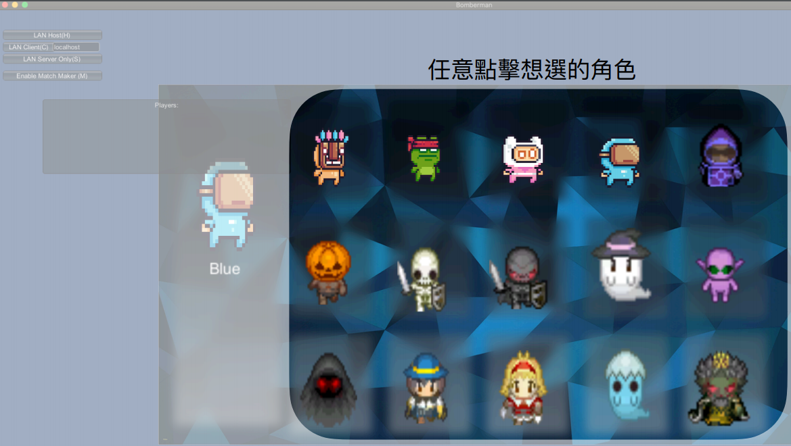
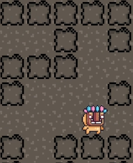
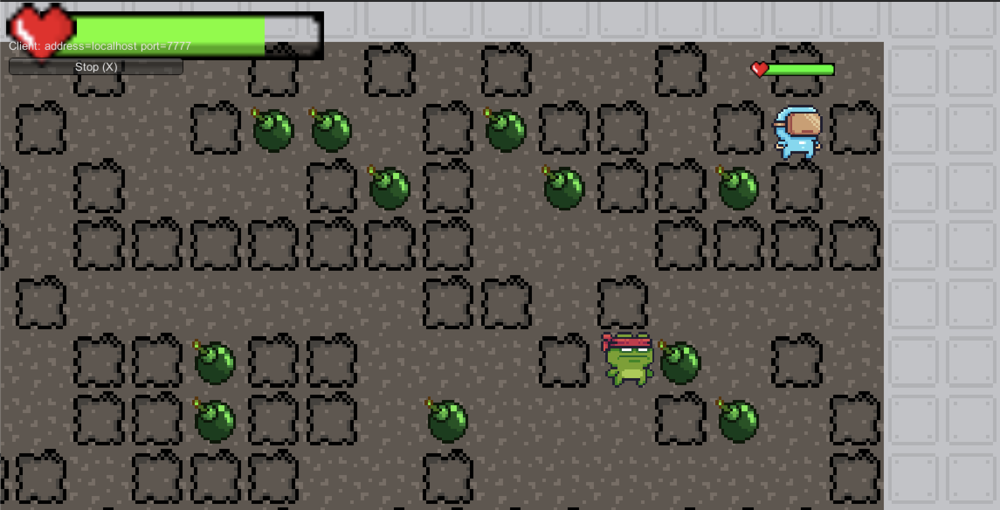
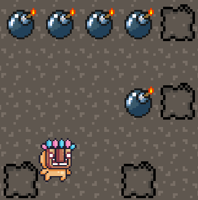
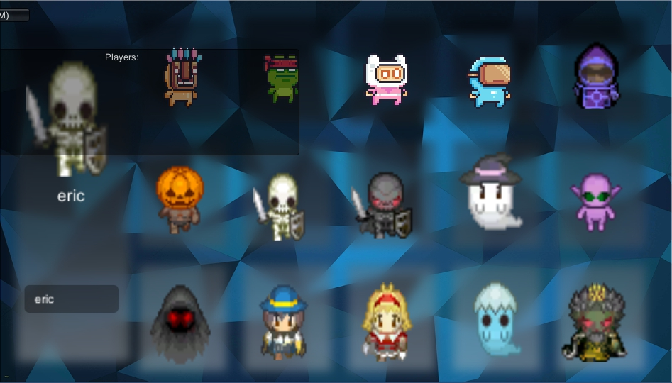
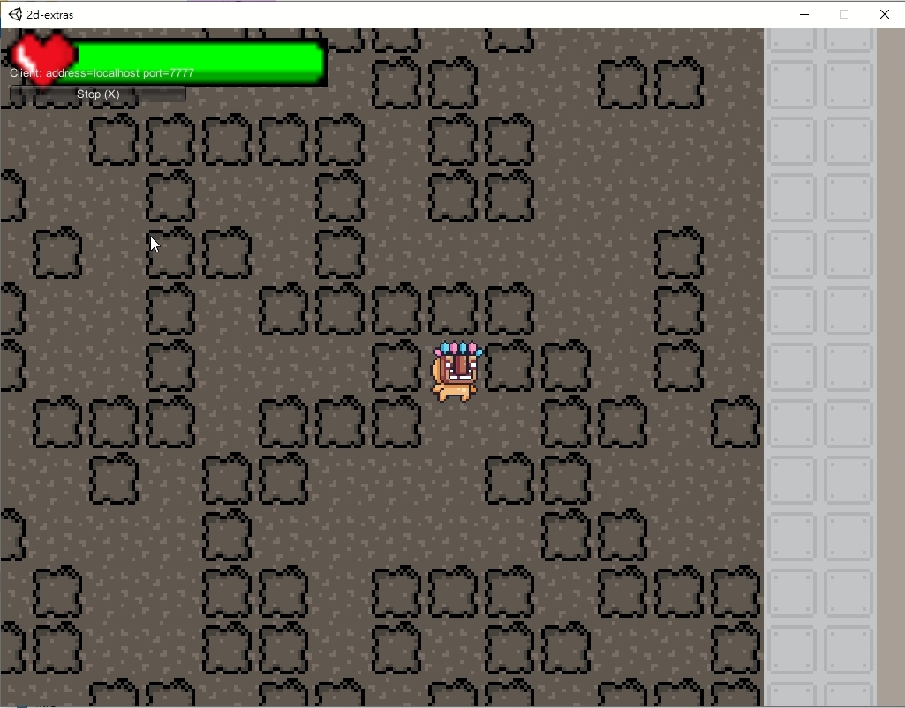

# Bomberman 

## Group 33

| 姓名   | 學號      | 系級   |
| ------ | --------- | ------ |
| 趙崇皓 | B06901104 | 電機三 |
| 林軒毅 | B06502147 | 電機三 |
| 王廷峻 | B06901061 | 電機三 |

## 前言
### [影片DEMO](https://youtu.be/6v4whwohpU0)
在這次電網導Final Project當中，我們實作了經典遊戲—Bomberman。玩家透過放置炸彈以及拾取道具來消滅敵人，當成為場上最後的玩家即勝利。

這份遊戲是我們 **從頭開始** 製作。我們沒有使用單人模板，從 0 開始，最終成為可以支援多項功能，內容完善的多人遊戲。以下將會說明如何遊玩以及遊戲特色：
## How to Play

### Unzip Files

### Open Server
- Click `Bomberman.exe`
- Click "LAN Server Only"

### Open Client(2~11 players can start the game)
- Click `Bomberman.exe`

### Select Your Character

 

### Connect to Server()(if you're localhost，then click "LAN Client" directly)

### Click Start

## 指令介紹
- WASD or 上下左右:移動
- 空白鍵:放置炸彈
- 每人放置上限3顆炸彈
- 放完3顆後有冷卻時間5秒，5秒後Reload
- 吃到綠色的道具可增加放置炸彈上限1顆
- 每個人有基礎血量10滴，自己的血量顯示於螢幕左上方，敵人血量顯示於角色上方
- 場上最後一名玩家勝利

## 指令圖示

### 基礎爆爆王遊戲功能

1. 上下左右鍵移動

|                              |                              |
| :--------------------------: | :--------------------------: |
|  |  |

2. 空白鍵投放炸彈

3. 炸彈計時爆炸摧毀地圖方塊

4. 血量控制

5. 觀看其他玩家血量

6. 炸彈放置數量控制

### 進階遊戲功能
1. 控制連線人數(2~11人皆可開始遊戲)

- 兩人連線

- 十一人連線

2. 等候室（Lobby Scene）讓玩家準備

- 按下Start表示準備完畢，同時也可觀看其他玩家準備狀態

3. 自由選擇角色與名字

4. 隨機生成遊戲地圖

5. 隨機生成道具

