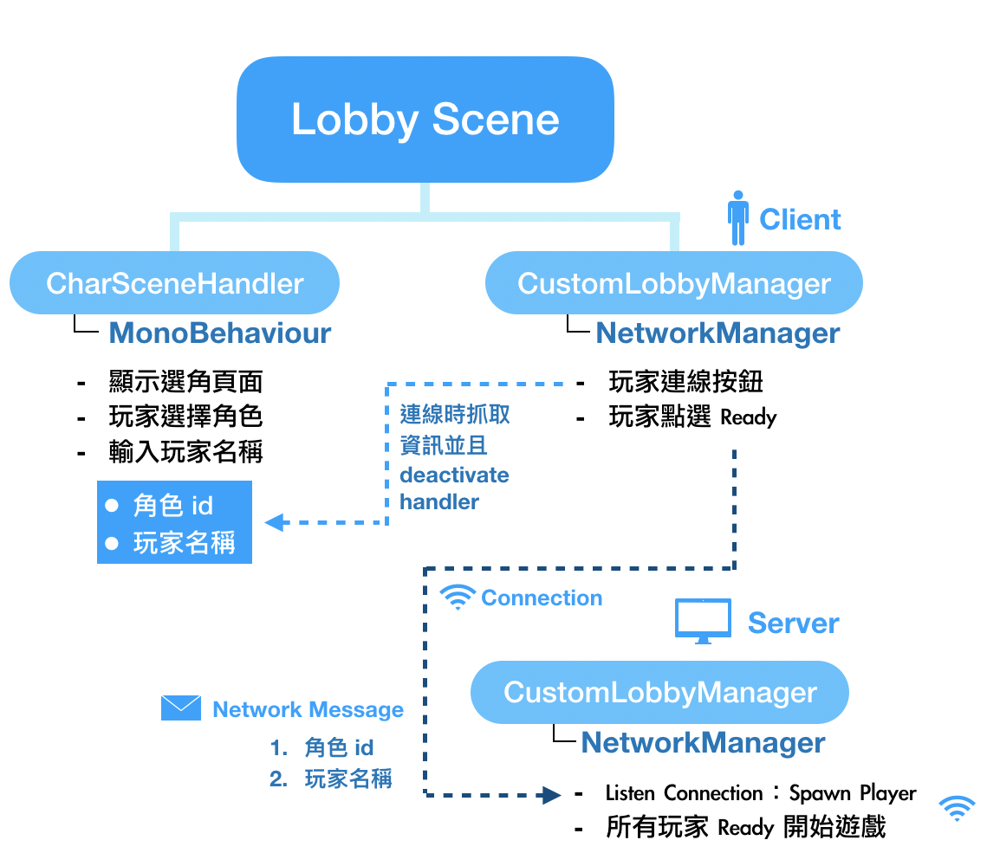
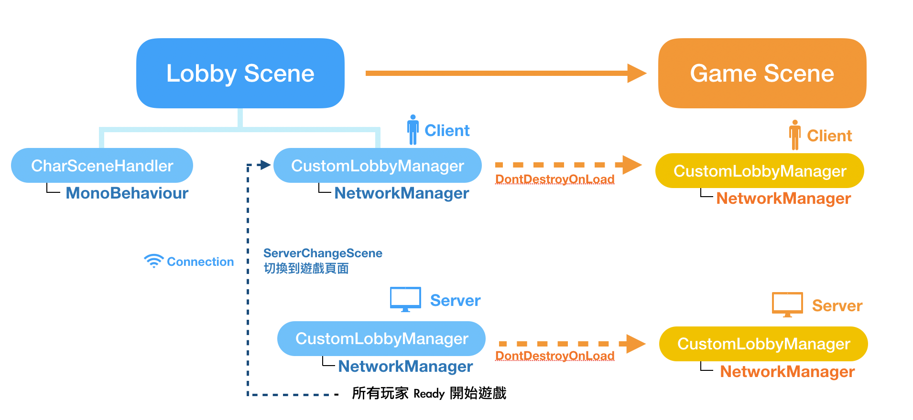
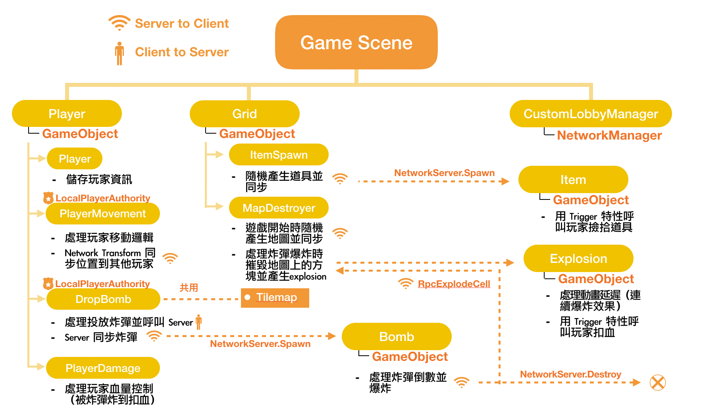

# ICN Final Project Report：Group 33

## 組員

| 姓名   | 學號 | 系級   |
| ------ | ---- | ------ |
| 趙崇皓 |      | 電機三 |
| 林軒毅 |      | 電機三 |
| 王廷峻 |      | 電機三 |

## 目錄

1. 遊戲介紹與功能
2. 遊戲架構
3. 開發邏輯與優化設計
4. 分工

## 遊戲介紹與功能

我們的爆爆王多人遊戲支援以下功能：

1. 基礎爆爆王遊戲功能
   1. 玩家上下左右鍵移動
   2. 玩家空白鍵投放炸彈
   3. 炸彈計時爆炸摧毀方塊
   4. 玩家血量控制
   5. 地圖上隨機生成道具
2. 進階遊戲功能
   1. 連線頁面（Lobby Scene）控制連線人數
   2. 玩家選擇角色與名字
   3. 隨機生成遊戲地圖

## 遊戲架構

首先，這份遊戲是我們 **從頭開始** 製作。我們沒有使用單人模板，從 0 開始，最終成為可以支援多項功能，內容完善的多人遊戲。

上述每一項功能中的資料傳輸都與多人連線結合，我們花了許多心思設計資料傳輸的架構及邏輯。下圖是遊戲的網路架構，以及各個遊戲場景中的遊戲元素。

我們的遊戲由兩個 Scene 組成，分別是 Lobby 和 Game Scene。Lobby 就是玩家選擇角色並且等待的頁面，而Game Scene 就是實際遊戲的頁面。下面分別介紹兩個 Scene 的架構，以及 Scene 間如何切換。圖中的虛線箭頭代表資料傳輸的方向。

### 連線頁面



玩家一開始打開遊戲，進入的是 Lobby 的等待頁面。這個頁面有兩個 Component，分別是：

1. CharSceneHandler
2. CustomLobbyManager

CharSceneHandler 和網路無關，單純是負責處理玩家選取角色，輸入名稱的物件。當玩家選完角色，可以點選 Client，就會連線到 Server，這時 CustomLobbyManager （Client）就會抓取 CharSceneHandler 中玩家的角色資訊，並且傳送 Network Message 給 Server。

玩家點選 Ready 以後，就會進入等待，直到連線的人數大於等於 minPlayers （可以自己設定的參數）。當超過 minPlayers 的玩家連線以後，Server 上的 CustomLobbyManager 就會在所有玩家的頁面 Spawn 出 Player Object，並且告訴玩家要切換 Scene 到 GameScene，開始遊戲。

## 場景切換



當足夠玩家連線後，Server 的 CustomLobbyManager 就會叫玩家把 Scene 都換成 GameScene。注意 CustomLobbyManager 是繼承 NetworkManager，並且我們將他設定了 DontDestroyOnLoad 的特性，代表 CustomLobbyManager 進入 GameScene 不會被摧毀，並且繼續擔任 NetworkManager，負責所有資料的傳輸。

### 遊戲場景



真正的遊戲場景中，有許多的元素需要討論。在玩家一開始進入遊戲場景時，已經存在的物件有：

1. Player：玩家（以及其他 Client 玩家）
2. Grid：遊戲世界的地圖以及磚塊物件
3. CustomLobbyManager：從 LobbyScene開始持續存在的 NetworkManager

在遊戲過程中，會被動態產生（Spawn）的物件有：

1. Bomb：炸彈
2. Explosion：爆炸動畫
3. Item：道具

在下一個章節，我們會詳細介紹這些元素如何利用網路互相溝通。

##開發邏輯與優化設計

我們針對遊戲場景中的每一個功能，詳細說明我們如何利用 Unity 達到多人連線以及同步的目的，並且解釋如此設計有何優點以及為何可以增加遊戲效能。


### 玩家移動

處理完家移動的邏輯定義在 PlayerMovement （在Player 物件中）中。由於只有 LocalPlayer 有權移動自己（其他玩家單純是 sync 這個玩家的位置）因此我們指定 **LocalPlayerAuthority** 給 PlayerMovement。在每個 frame update 中，PlayerMovement 會偵測玩家有無按下上下左右鍵，並且移動玩家。

```c#
    void Update()
    {
        if(this.isLocalPlayer)
        {
            movement.x = Input.GetAxisRaw("Horizontal");
            movement.y = Input.GetAxisRaw("Vertical");
        }
    }
    
    void FixedUpdate()
    {
        if(this.isLocalPlayer)
        {
            rb.MovePosition(rb.position + movement * moveSpeed * Time.fixedDeltaTime);
        }
    }
```

注意在 Update 中需要判斷 `this.isLocalPlayer` 才可以更新。由於 PlayerMovement 這個 script 是每個玩家都有一份，如果沒有判斷 isLocalPlayer，則按下按鍵場上所有玩家都會移動，這顯然不是我們希望看到的。

另外，在程式碼中的寫法，我們在每個 frame update 都偵測使用者輸入，在 fixed update 才移動玩家。詳細原因我們參考資源如下：

- https://stackoverflow.com/questions/34447682/what-is-the-difference-between-update-fixedupdate-in-unity

簡而言之，update 和物理引擎的計算是獨立的，而 fixed update 和物理引擎是同步的，所以有關物理量的更新（如這個例子中的位移和速度）都應該要放在 fixed update 中。

現在 local 玩家可以移動自己，我們加入 **NetworkTransform** 到 Player 物件中，這樣玩家的位置就可以藉由 NetworkManager 同到其他玩家的視窗中。

### 投放炸彈

處理完家移動的邏輯定義在 DropBomb（在Player 物件中）中。和 PlayerMovement 一樣，頭放炸彈應該只有 localPlayer 可以執行，所以我們要加入 **LocalPlayerAuthority**。在每個 update 中，我們會檢查玩家是否有按下空白鍵：

```C#
void Update()
    {
        if (Input.GetKeyDown("space") && this.isLocalPlayer)
        {
            if (currentBomb < MaxBomb)
            {
                currentBomb++;
                CmdDropBomb(); // Send message to server.
            } 
        }
        if (currentBomb == MaxBomb)
        {
            if (!cool)
            {
                countdown = 5f;
                cool = true;
            }
            else if (cool)
            {
                countdown -= Time.deltaTime;
                if(countdown <= 0f)
                {
                    cool = false;
                    currentBomb = 0;
                }
            }
            
        }
    }
```

程式碼中我們有設定一個 cooldown 變數，這是我們加的宜外功能，簡而言之就是玩家投放玩一定數量的炸彈後，要等一段時間才能繼續放炸彈。這邊重點我們放在 **`CmdDropBomb`** 這個呼叫。

在 Unity 中，**Cmd** 開頭的函式代表 **Client 呼叫後，在 Server 上執行**。這個意思是說，只有 Client 可以呼叫 Cmd 函式， 而 Server 會執行 Cmd 函式裡面的內容。

```c#
    [Command]
    void CmdDropBomb()
    {
        if(NetworkServer.active)
        {
            Vector3 playerPos = rb.position;
            Vector3Int cell = tilemap.WorldToCell(playerPos);
            Vector3 cellCenterPos = tilemap.GetCellCenterWorld(cell);
            GameObject bomb = Instantiate(bombPrefab, cellCenterPos, Quaternion.identity) as GameObject;
            NetworkServer.Spawn(bomb);
        }
    }
```

當玩家投放炸彈呼叫 CmdDropBomb 以後，Server 會執行 CmdDropBomb。函式內容是抓取玩家位置，轉換成 tilemap 的座標（玩家位置是連續，tilemap 是離散。我們希望炸彈只能被放在 tilemap 的方格中），就可以在該 tilemap 座標投放一個炸彈。接著，**NetworkServer.Spawn(bomb)** 會讓所有 Client 的遊戲視窗中的同樣位置產生一個炸彈物件，達到同步的效果。基本上，就是 client emit 一個 event，然後 server 把 event broadcast 到其他 client 的概念。

### 炸彈爆炸

炸彈爆炸是定義在 Bomb 腳本中（attach 在 Bomb 物件上）。Bomb 的 update 會計算 Bomb 的倒數時間，並且在倒數結束時，把炸彈摧毀。

```c#
	void Update () {
		{
			countdown -= Time.deltaTime;
			if (countdown <= 0f)
			{
				if (!isClient && isServer)
				{
					DestroyBomb();
				}
			}
		}
	}
```

注意這邊我們是只讓 Server 呼叫 DestroyBomb 函式，並在之後在處理 client - server syncing 的問題。這邊是因為如果每個玩家的視窗自己處理炸彈爆炸，由於一開始 Spawn 時的時間差，可能會一個玩家視窗炸彈摧毀另外一個玩家卻還沒摧毀的問題，所以我們設計上 Server 處理炸彈摧毀。

在 Server 呼叫 DestroyBomb 後，會執行以下內容：

```c#
	void DestroyBomb()
	{
		FindObjectOfType<MapDestroyer>().RpcExplode(transform.position); // client rpc
		FindObjectOfType<MapDestroyer>().Explode(transform.position); // server destroy
		Destroy(this.gameObject);
		NetworkServer.Destroy(this.gameObject);
	}
```

最後兩行很直觀，就是摧毀這個網路中的炸彈物件（不然炸彈位一直累積在網路中，消耗記憶體）。前面兩行是在炸彈摧毀後，要產生爆炸的動畫以及爆炸摧毀地圖中的方塊。至於這邊又看到了一個新的函式開頭：**Rpc**，我們會在下一個段落解釋。

### 爆炸動畫以及摧毀磚塊

當 Server 呼叫摧毀炸彈後，呼叫了 MapDestroyer 的 Explode 和 RpcExplode。兩個函式在做的事情都是一樣的，就是以炸彈位址作為中心點，十字的產生爆炸：

```c#
	public void Explode(Vector3 cell)
	{
		ExplodeCell(cell);
		ExplodeCell(cell + new Vector3(1, 0, 0));
		ExplodeCell(cell + new Vector3(2, 0, 0));
		ExplodeCell(cell + new Vector3(0, 1, 0));
		ExplodeCell(cell + new Vector3(0, 2, 0));
		ExplodeCell(cell + new Vector3(-1, 0, 0)); 
		ExplodeCell(cell + new Vector3(-2, 0, 0));
		ExplodeCell(cell + new Vector3(0, -1, 0));
		ExplodeCell(cell + new Vector3(0, -2, 0));
	}
```

ExplodeCell 函式如下。函式會把傳入位置轉換成 tilemap 座標，並且檢查該位置是否可以產生爆炸（如果是牆壁tile 就不行，磚塊 tile 就可以），並把該位置的磚塊 tile 摧毀。

```c#
	void ExplodeCell(Vector3 cell)
	{
		Vector3Int floor_cell = Vector3Int.FloorToInt(cell);
		Vector3 pos = tilemap.GetCellCenterWorld(floor_cell);
		Tile tile = tilemap.GetTile<Tile>(floor_cell);

		if (tile == wallTile)
		{
			return;
		}

		Instantiate(explosionPrefab, pos, Quaternion.identity);
		if (tile == destructibleTile)
		{
			tilemap.SetTile(floor_cell, null);
		}
		return;
	}
```

**Rpc** 開頭的函式代表：**Server 命令 Client 執行函式**，可以想成 **Cmd** 的相反。因此，當 server 呼叫 **RpcExplodeCell**，網路中所有的 client 都會執行 RpcExplodeCell 的函式，分別處理自己的 tilemap 中的爆炸。注意這裡爆炸是 **每個Client獨立處理** 。由於 server 已經讓炸彈的摧毀同步了，因此爆炸效果 client 自己處理就可以達到近乎同步的效果。反之，如果讓 server 處理所有的爆炸，server 的負擔會太重（一個炸彈會造成九個格子爆炸，因此如果讓 server 處理就會多出摧毀炸彈的九倍的負荷）。

這裏的設計就是 client-server trade off 的概念，我們是要讓每個動作都由 server 處理，還是可以犧牲一點點同步性，把一些判斷交給 client 做。這個例子裡面，就是把爆炸效果的計算量轉嫁給 client。

### 血量條

