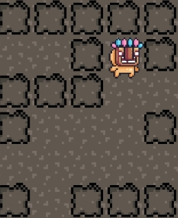
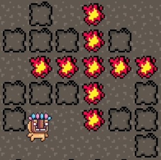

# ICN Final Project Report：Group 33

## 組員

| 姓名   | 學號      | 系級   |
| ------ | --------- | ------ |
| 趙崇皓 | B06901104 | 電機三 |
| 林軒毅 | B06502147 | 電機三 |
| 王廷峻 | B06901061 | 電機三 |

## 目錄

### 1. 前言
### 2. 遊戲架構
### 3. 網路優化
### 4. 程式邏輯
### 5. 分工與總結

## 前言

### [影片DEMO](https://youtu.be/6v4whwohpU0)

在這次電網導Final Project當中，我們實作了經典遊戲—Bomberman。玩家透過放置炸彈以及拾取道具來消滅敵人，當成為場上最後的玩家即勝利。

這份遊戲是我們 **從頭開始** 製作。我們沒有使用單人模板，從 0 開始，最終成為可以支援多項功能，內容完善的多人遊戲。我們的爆爆王支援以下功能：

### 基礎爆爆王遊戲功能
1. 上下左右鍵移動




2. 空白鍵投放炸彈


3. 炸彈計時爆炸摧毀地圖方塊



4. 血量控制


5. 觀看其他玩家血量


6. 炸彈放置數量控制


### 進階遊戲功能
1. 控制連線人數(2~11人皆可開始遊戲)

- 兩人連線


- 十一人連線


2. 等候室（Lobby Scene）讓玩家準備

- 按下Start表示準備完畢，同時也可觀看其他玩家準備狀態


3. 自由選擇角色與名字


4. 隨機生成遊戲地圖


5. 隨機生成道具


下一部分，我們會詳述遊戲的整體架構，並包含流程圖輔以文字，能夠更清楚瞭解Server和Client分別處理那些工作。

## 遊戲架構

上述提到每一項功能中的資料傳輸都與多人連線結合，我們花了許多心思設計資料傳輸的架構及邏輯。以下部分是遊戲的網路架構，以及各個遊戲場景中的遊戲元素。

我們的遊戲由兩個 Scene 組成，分別是 Lobby 和 Game Scene。Lobby Scene 為玩家選擇角色並且等待的頁面，而Game Scene 則是實際遊戲的頁面。下面分別介紹兩個 Scene 的架構，以及 Scene 間如何切換。圖中的虛線箭頭代表資料傳輸的方向。

### Lobby Scene


玩家一開始打開遊戲，進入的是 Lobby 的等待頁面。這個頁面有兩個 Component，分別是：

1. CharSceneHandler
2. CustomLobbyManager

CharSceneHandler 和網路無關，單純是負責處理玩家選取角色，輸入名稱的物件。當玩家選完角色，可以點選LAN Client，就會連線到 Server，這時 CustomLobbyManager （Client）就會抓取 CharSceneHandler 中玩家的角色資訊，並且傳送 Network Message 給 CustomLobbyManager (Server)。

切換到Lobby後，當玩家點選 Start ，代表準備完畢。等到超過 minPlayers（可以自己設定的參數）的玩家連線並且都準備完畢，Server 上的 CustomLobbyManager 就會在所有玩家的頁面 Spawn 出 Player Object，並且告訴玩家要切換 Scene 到 GameScene，開始遊戲。

### 場景切換


當足夠玩家連線後，Server 的 CustomLobbyManager 就會叫玩家把 Scene 都換成 GameScene。注意 CustomLobbyManager 是繼承 NetworkManager，並且我們將他設定了 DontDestroyOnLoad 的特性，代表 CustomLobbyManager 進入 GameScene 不會被摧毀，並且繼續擔任 NetworkManager，負責所有資料的傳輸。

### Game Scene


真正的遊戲場景中，有許多的元素需要討論。在玩家一開始進入遊戲場景時，已經存在的物件有：

1. Player：玩家（以及其他 Client 玩家）
2. Grid：遊戲世界的地圖以及磚塊物件
3. CustomLobbyManager：從 LobbyScene開始持續存在的 NetworkManager

在遊戲過程中，會被動態產生（Spawn）的物件有：

1. Bomb：炸彈
2. Explosion：爆炸動畫
3. Item：道具，增加玩家炸彈數量上限
4. Destructable Tile：隨機生成並可被炸彈摧毀的方塊

在下兩個章節，我們會詳細介紹這些元素如何利用網路互相溝通。並且特別提出我們在網路上做了那些優化，並且遊戲邏輯又是如何設計。

## 網路優化

這個章節先將遊戲中網路部分特別提出來進行（要有更詳細的理解，可能要搭配下章節程式邏輯閱讀），並且解釋如此設計**為何可以增加遊戲效能**（如何提升 **QoS**）以及有何 **tradeoff**。

| 功能                 | Client                                                       | Server                                                       | 原因                                                         |
| -------------------- | ------------------------------------------------------------ | ------------------------------------------------------------ | ------------------------------------------------------------ |
| 玩家移動             | 偵測 local 使用者輸入，並更新 local 玩家位置。               | 接收每個玩家更新後的位置，並 broadcast 給其他玩家。          | 針對玩家移動這種幾乎每個 frame 都更新的操作，如果讓 server 計算會產生極大的負擔。因此，我們讓 client 分別計算自己玩家的位置，如此一來，除了可以讓 local 玩家的遊戲體驗更流暢， server 也只需 broadcast 最終位置，減輕負擔。 |
| 投放炸彈             | 偵測 local 使用者輸入，並告知 server 投放炸彈的事件。        | 接收 client 投放炸彈的訊息，將炸彈 spawn 到網路中。          | 由於投放炸彈的頻率較低，client 偵測 local 玩家投放炸彈的事件即可，並不會太大的影響遊戲體驗，因此不需要 client 自己去偵測**每個**玩家投放炸彈的事件。另外，因為炸彈爆炸是由倒數計時決定，讓 server 統一 spawn 炸彈可以確保同步性，增加遊戲流暢度。 |
| 炸彈爆炸             | Server 告知炸彈爆炸的訊息。                                  | 倒數計時結束，server 會通知 client 該炸彈要爆炸。            | 由於每個 client 都有 server spawn 的炸彈，每個炸彈都會自己倒數計時， |
| 摧毀炸彈以及爆炸動畫 | 在 server 通知炸彈爆炸後，自行產生爆炸動畫。                 | 把網路上該炸彈物件全部移除。                                 | 基本上，炸彈摧毀已經與遊戲無關，只是記憶體利用問題，因此也可以讓 client 自己摧毀，這邊選擇給 server 摧毀沒有特別原因。至於爆炸動畫的產生，由於炸彈爆炸的事件是 server 同一時間發送的，因此爆炸動畫由 client 自己 render 不會有延遲的問題。如果爆炸動畫讓 server 處理，會多上炸彈爆炸 9 倍的負擔（一個炸彈會產生 9 格的爆炸），為了平衡 server 的運算資源，所以把爆炸動畫的負擔轉嫁給 client。 |
| 血量條與扣血         | Local 玩家 自己計算和爆炸物件的 collision。                  | 無                                                           | 同 **玩家移動** 的原因。                                     |
| 產生道具以及撿拾道具 | Local 玩家 自己計算和道具物件的 collision。                  | Server 依照時間產生道具並 spawn 到網路上。                   | 玩家沒有權利生成道具，所以道具一定是由 server 產生的。至於撿拾道具只和 local 玩家有關，因此和道具物件的碰撞由 client 自己處理即可。 |
| 產生地圖             | 同步地圖資訊（非整個地圖）並產生地圖。                       | 隨機產生地圖資訊。                                           | Server 只負責產生地圖中的資訊（如磚塊位置，由數字型態儲存），Client 只同步這些資訊，不會同步整個地圖物件。Client 可以利用地圖資訊自己生成地圖。因為地圖只會生成一次，基本上這邊如何傳輸資料不會對遊戲體驗有太多的影響。 |
| 玩家死亡             | Local 玩家 每個 frame 都偵測血量是否為 0 。如果玩家沒血，則通知 server 玩家死亡事件。 | Server 會維護一個 dictionary 紀錄當前在場上的玩家。接收玩家死亡事件後，將玩家從 dictionary 移除，並且負責摧毀網路上該玩家物件。 | 由於 local 玩家的血量是自己判斷的，因此玩家死亡也必須是 local 玩家 自己判斷的。至於 Server 必須要多維護一個 dictionary 儲存當前場上玩家，才有辦法判斷遊戲結束。 |
| 遊戲結束             | 無                                                           | Dictionary 只剩一個玩家，會告知全體玩家遊戲結束。            | 因為遊戲結束是需要完全同步的，因此判斷場上玩家的數量完全 在 server 上進行。 |
**(待補)**

## 程式邏輯

這個章節，再讓我們從遊戲開始到結束，一步步利用程式碼說明我們如何利用 Unity 達到多人連線以及同步的目的。

### 遊戲開始

由於 CustomLobbyManager 是處理整個遊戲的網路邏輯，因此我們把重要的玩家資訊記錄在 CustomLobbyManager 裡面。其中，當玩家被創建時，我們會把這些玩家存在一個 Dictionary 裡面。

Dictionary 定義：

```c#
public Dictionary<string, GameObject> players = new Dictionary<string, GameObject>();
```

玩家進入遊戲畫面：

```c#
public override bool OnLobbyServerSceneLoadedForPlayer(GameObject lobbyPlayer, GameObject gamePlayer)
{
    Debug.Log(lobbyPlayer.GetComponent<LobbyPlayer>());
    
    gamePlayer.GetComponent<Player>().char_id = lobbyPlayer.GetComponent<LobbyPlayer>().char_id;
    gamePlayer.GetComponent<Player>().name = lobbyPlayer.GetComponent<LobbyPlayer>().name;
    string uuid = System.Guid.NewGuid().ToString();
    gamePlayer.GetComponent<Player>().uuid = uuid;
    players[uuid] = gamePlayer; // Add player to dict
    return true;
}
```

從最後一行可以看出，我們指定每個玩家一個獨一無二的 id ，然後以這個 id 當成 key，把玩家物件加入 Dictionary 中。

至於玩家生成的位置由於和地圖有關，我們會在 **產生地圖** 中說明。

### 玩家移動

處理完家移動的邏輯定義在 PlayerMovement （在Player 物件中）中。由於只有 LocalPlayer 有權移動自己（其他玩家單純是 sync 這個玩家的位置）因此我們指定 **LocalPlayerAuthority** 給 PlayerMovement。在每個 frame update 中，PlayerMovement 會偵測玩家有無按下上下左右鍵，並且移動玩家。

```c#
void Update()
{
    if(this.isLocalPlayer)
    {
        movement.x = Input.GetAxisRaw("Horizontal");
        movement.y = Input.GetAxisRaw("Vertical");
    }
}

void FixedUpdate()
{
    if(this.isLocalPlayer)
    {
        rb.MovePosition(rb.position + movement * moveSpeed * Time.fixedDeltaTime);
    }
}
```

注意在 Update 中需要判斷 `this.isLocalPlayer` 才可以更新。由於 PlayerMovement 這個 script 是每個玩家都有一份，如果沒有判斷 isLocalPlayer，則按下按鍵場上所有玩家都會移動，這顯然不是我們希望看到的。

另外，在程式碼中的寫法，我們在每個 frame update 都偵測使用者輸入，在 fixed update 才移動玩家。詳細原因我們參考資源如下：

- https://stackoverflow.com/questions/34447682/what-is-the-difference-between-update-fixedupdate-in-unity

簡而言之，update 和物理引擎的計算是獨立的，而 fixed update 和物理引擎是同步的，所以有關物理量的更新（如這個例子中的位移和速度）都應該要放在 fixed update 中。

現在 local 玩家可以移動自己，我們加入 **NetworkTransform** 到 Player 物件中，這樣玩家的位置就可以藉由 NetworkManager 同到其他玩家的視窗中。

### 投放炸彈

處理完家移動的邏輯定義在 DropBomb（在Player 物件中）中。和 PlayerMovement 一樣，頭放炸彈應該只有 localPlayer 可以執行，所以我們要加入 **LocalPlayerAuthority**。在每個 update 中，我們會檢查玩家是否有按下空白鍵：

```C#
void Update()
    {
        if (Input.GetKeyDown("space") && this.isLocalPlayer)
        {
            if (currentBomb < MaxBomb)
            {
                currentBomb++;
                CmdDropBomb(); // Send message to server.
            } 
        }
        if (currentBomb == MaxBomb)
        {
            if (!cool)
            {
                countdown = 5f;
                cool = true;
            }
            else if (cool)
            {
                countdown -= Time.deltaTime;
                if(countdown <= 0f)
                {
                    cool = false;
                    currentBomb = 0;
                }
            }
            
        }
    }
```

程式碼中我們有設定一個 cooldown 變數，這是我們加的宜外功能，簡而言之就是玩家投放玩一定數量的炸彈後，要等一段時間才能繼續放炸彈。這邊重點我們放在 **`CmdDropBomb`** 這個呼叫。

在 Unity 中，**Cmd** 開頭的函式代表 **Client 呼叫後，在 Server 上執行**。這個意思是說，只有 Client 可以呼叫 Cmd 函式， 而 Server 會執行 Cmd 函式裡面的內容。

```c#
[Command]
void CmdDropBomb()
{
    if(NetworkServer.active)
    {
        Vector3 playerPos = rb.position;
        Vector3Int cell = tilemap.WorldToCell(playerPos);
        Vector3 cellCenterPos = tilemap.GetCellCenterWorld(cell);
        GameObject bomb = Instantiate(bombPrefab, cellCenterPos, Quaternion.identity) as GameObject;
        NetworkServer.Spawn(bomb);
    }
}
```

當玩家投放炸彈呼叫 CmdDropBomb 以後，Server 會執行 CmdDropBomb。函式內容是抓取玩家位置，轉換成 tilemap 的座標（玩家位置是連續，tilemap 是離散。我們希望炸彈只能被放在 tilemap 的方格中），就可以在該 tilemap 座標投放一個炸彈。接著，**NetworkServer.Spawn(bomb)** 會讓所有 Client 的遊戲視窗中的同樣位置產生一個炸彈物件，達到同步的效果。基本上，就是 client emit 一個 event，然後 server 把 event broadcast 到其他 client 的概念。

### 炸彈爆炸

炸彈爆炸是定義在 Bomb 腳本中（attach 在 Bomb 物件上）。Bomb 的 update 會計算 Bomb 的倒數時間，並且在倒數結束時，把炸彈摧毀。

```c#
void Update () {
    {
        countdown -= Time.deltaTime;
        if (countdown <= 0f)
        {
            if (!isClient && isServer)
            {
                DestroyBomb();
            }
        }
    }
}
```

注意這邊我們是只讓 Server 呼叫 DestroyBomb 函式，並在之後在處理 client - server syncing 的問題。這邊是因為如果每個玩家的視窗自己處理炸彈爆炸，由於一開始 Spawn 時的時間差，可能會一個玩家視窗炸彈摧毀另外一個玩家卻還沒摧毀的問題，所以我們設計上 Server 處理炸彈摧毀。

在 Server 呼叫 DestroyBomb 後，會執行以下內容：

```c#
void DestroyBomb()
{
    FindObjectOfType<MapDestroyer>().RpcExplode(transform.position); // client rpc
    FindObjectOfType<MapDestroyer>().Explode(transform.position); // server destroy
    Destroy(this.gameObject);
    NetworkServer.Destroy(this.gameObject);
}
```

最後兩行很直觀，就是摧毀這個網路中的炸彈物件（不然炸彈位一直累積在網路中，消耗記憶體）。前面兩行是在炸彈摧毀後，要產生爆炸的動畫以及爆炸摧毀地圖中的方塊。至於這邊又看到了一個新的函式開頭：**Rpc**，我們會在下一個段落解釋。

### 爆炸動畫以及摧毀磚塊

當 Server 呼叫摧毀炸彈後，呼叫了 MapDestroyer 的 Explode 和 RpcExplode。兩個函式在做的事情都是一樣的，就是以炸彈位址作為中心點，產生十字形的爆炸：

```c#
public void Explode(Vector3 cell)
{
    ExplodeCell(cell);
    ExplodeCell(cell + new Vector3(1, 0, 0));
    ExplodeCell(cell + new Vector3(2, 0, 0));
    ExplodeCell(cell + new Vector3(0, 1, 0));
    ExplodeCell(cell + new Vector3(0, 2, 0));
    ExplodeCell(cell + new Vector3(-1, 0, 0)); 
    ExplodeCell(cell + new Vector3(-2, 0, 0));
    ExplodeCell(cell + new Vector3(0, -1, 0));
    ExplodeCell(cell + new Vector3(0, -2, 0));
}
```

ExplodeCell 函式如下。函式會把傳入位置轉換成 tilemap 座標，並且檢查該位置是否可以產生爆炸（如果是牆壁tile 就不行，磚塊 tile 就可以），並把該位置的磚塊 tile 摧毀。

```c#
void ExplodeCell(Vector3 cell)
{
    Vector3Int floor_cell = Vector3Int.FloorToInt(cell);
    Vector3 pos = tilemap.GetCellCenterWorld(floor_cell);
    Tile tile = tilemap.GetTile<Tile>(floor_cell);

    if (tile == wallTile)
    {
        return;
    }

    Instantiate(explosionPrefab, pos, Quaternion.identity);
    if (tile == destructibleTile)
    {
        tilemap.SetTile(floor_cell, null);
    }
    return;
}
```

**Rpc** 開頭的函式代表：**Server 命令 Client 執行函式**，可以想成 **Cmd** 的相反。因此，當 server 呼叫 **RpcExplodeCell**，網路中所有的 client 都會執行 RpcExplodeCell 的函式，分別處理自己的 tilemap 中的爆炸。注意這裡爆炸是 **每個Client獨立處理** 。由於 server 已經讓炸彈的摧毀同步了，因此爆炸效果 client 自己處理就可以達到近乎同步的效果。反之，如果讓 server 處理所有的爆炸，server 的負擔會太重（一個炸彈會造成九個格子爆炸，因此如果讓 server 處理就會多出摧毀炸彈的九倍的負荷）。

這裏的設計就是 client-server trade off 的概念，我們是要讓每個動作都由 server 處理，還是可以犧牲一點點同步性，把一些判斷交給 client 做。這個例子裡面，就是把爆炸效果的計算量轉嫁給 client。

### 血量條與扣血

當爆炸產生而玩家碰到爆炸時，玩家的血量會減少。這邊利用的是 collider trigger 的特性，把 explosion 物件加入 trigger 特性，當玩家碰到爆炸時，就會引發玩家呼叫自己的扣血函式。

```c#
void OnTriggerEnter2D(Collider2D collision)
{
    PlayerDamage player = collision.GetComponent<PlayerDamage>();
    if (player != null)
    {
        player.TakeDamage(1); 
    }
}
```

玩家扣血是在 PlayerDamage 腳本中被定義的（隸屬 Player 物件）。PlayerDamage 儲存了 maxHealth 和 currentHealth 兩個變數。當呼叫 TakeDamage(damage)，currentHealth 會減少 damage 的量。

```c#
public void TakeDamage(int damage)
{
    if(this.isLocalPlayer)
    {
        currentHealth -= damage;
        healthBar.SetHealth(currentHealth);
    }
    else
    {
        currentHealth -= damage;
        healthBarFollow.SetHealth(currentHealth);
    }
}
```

至於血量條的顯示，我們的設計為：

1. 玩家自己的血量條：顯示在左上方。
2. 其他玩家的血量條：顯示在其他玩家頭頂上。


玩家物件和遊戲畫面分別都有一個 HealthBar Canvas。我們只需要在遊戲開始用 isLocalPlayer 來判斷要顯示哪個 canvas 就好了。

```c#
void Start()
{
    currentHealth = maxHealth;
    // Large HealthBar
    if(this.isLocalPlayer)
    {
        healthBar.SetMaxHealth(maxHealth);
        transform.GetChild(0).gameObject.SetActive(false); // disable healthbar canvas for local
    }
    // Small HealthBar
    else
    {
        healthBarFollow = transform.GetChild(0).transform.GetChild(0).GetComponent<HealthBar>();
        healthBarFollow.SetMaxHealth(maxHealth);
    }
}
```

### 產生道具與撿拾道具

產生道具的腳本是 ItemSpawn（隸屬 Grid 物件）。道具應該是由中央控管，玩家沒有權利自己生成道具。所以在生成道具前需要先該物件是否 isServer，接著呼叫 ItemAdd。

```C#
void ItemAdd()
{
    Vector3Int rand = new Vector3Int(Random.Range(-10, 14), Random.Range(-4, 20), 0);
    Vector3 cellCenterPos = tilemap.GetCellCenterWorld(rand);
    Tile tile = tilemap.GetTile<Tile>(rand);
    if(tile== null)
    {
        GameObject item = Instantiate(itemPrefab, cellCenterPos, Quaternion.identity);
        NetworkServer.Spawn(item);
    }
}
```

ItemAdd 中，我們會隨機產生一個 cell position，檢查該位置是否可以放置道具，然後用 NetworkServer 把這些道具 Spawn 到每個玩家的視窗。

玩家撿拾道具和扣血一樣，利用 collider trigger 的特性，就可以知道哪個玩家碰到了道具。接著 trigger 被引發之後，道具就會在 Network 中被摧毀，同時該玩家可以放置的炸彈就會多一個。

```c#
    void OnTriggerEnter2D(Collider2D collision)
    {
        DropBomb player = collision.GetComponent<DropBomb>();
        if (player != null)
        {
            player.AddBomb(1);
        }
        Destroy(this.gameObject);
        NetworkServer.Destroy(this.gameObject);
    }
```

### 產生地圖

產生地圖定義在 MapDestroyer 中。我們先定義兩個 **SyncList**，紀錄生成磚塊的位置，以及不是磚塊的位置。由於定義為 SyncList，網路中的所有玩家都會同步裡面的資料

```C#
public SyncListInt tilePositions = new SyncListInt();
public SyncListInt emptyPositions = new SyncListInt();
```

在遊戲開始時，**Server** 上的MapDestroyer 的 Start 函式中會生成地圖：

```c#
void Start()
{
    if (!isClient && isServer)
    {
        // Generate Map Logic ... 
        serverSetup = true;
    }
}
```

玩家開始遊戲時會持續檢查 serverSetup，看看 server 是否已經生成好地圖了。當 server 生成好地圖後，玩家就會利用 tilePositions 中同步的資料來產生一樣的地圖。

```c#
void Update()
{
    if(serverSetup)
    {
        if (isClient)
        {
            foreach(int pos in tilePositions)
            {
                int x = (int)(pos / MAP_SIZE);
                int y = pos % MAP_SIZE;
                tilemap.SetTile(new Vector3Int(ANCHOR_X + x, ANCHOR_Y + y, 0), destructibleTile);
            }
            enabled = false; // 設定完地圖就不需要再執行 update
        }
    }
}
```

注意這邊我們傳輸的資料單純只是生成磚塊的位置，讓玩家自己去生成地圖。當然，也可以讓 Server 產生後去呼叫 NetworkServer.Spawn ，但跟傳送 int 型態（我們的寫法）比起來，server 負擔顯然還是較重，所以我們就選擇同步位置資訊就好。

接著我們會把玩家的位址隨機指定成 emptyPositions 中的某些位置（定義在 Player 中）：

```c#
void Update()
{
    var map = FindObjectOfType<MapDestroyer>();
    if(isServer && !isClient)
    {
        enabled = false;
    }
    if(this.isLocalPlayer)
    {
        if(map.serverSetup)
        {
            Debug.Log(map.tilePositions.Count);
            Debug.Log(map.emptyPositions.Count);

            int idx = UnityEngine.Random.Range(0, map.emptyPositions.Count);
            int x = (int)(map.emptyPositions[idx] / map.MAP_SIZE) + map.ANCHOR_X;
            int y = map.emptyPositions[idx] % map.MAP_SIZE + map.ANCHOR_Y;
            int z = (int)transform.position.z;
            Vector3Int cell = new Vector3Int(x, y, z);
            Vector3 cellCenterPos = map.tilemap.GetCellCenterWorld(cell);
            transform.position = cellCenterPos;
            enabled = false;
        }
    }
}
```

### 玩家死亡

玩家死亡定義在 `PlayerDamage.cs` 中。玩家的血被扣到沒有的時候，玩家就會呼叫 **Cmd** 函式，指定 Server 摧毀玩家物件。

```c#
void Update()
{
    if (this.isLocalPlayer && healthBar.GetHealth() <= 0)
    {
        CmdDestroyPlayer();
    }
}
```

下面的 **CmdDestroyPlayer** 函式只會在 server 上執行：

```c#
// PlayerDamage.cs
[Command]
void CmdDestroyPlayer()
{
    if(NetworkServer.active)
    {
        Destroy(gameObject);
        NetworkServer.Destroy(gameObject);
        FindObjectOfType<CustomLobbyManager>().removePlayer(gameObject);
    }
}
```

NetworkServer.Destroy 會把整個網路中的同一個玩家物件都摧毀。最後，我們會呼叫 Server 上的 CustomLobbyManager 的 removePlayer函式，也就是把玩家從一開始定義的 player Dictionary 移除：

```c#
// CustomLobbyManager.cs
public void removePlayer(GameObject gamePlayer)
{
    players.Remove(gamePlayer.GetComponent<Player>().uuid);
    if(players.Count == 1)
    {
        var player = players.FirstOrDefault().Value;
        FindObjectOfType<WinnerInfo>().char_id = player.GetComponent<Player>().char_id;
        FindObjectOfType<WinnerInfo>().name = player.GetComponent<Player>().name;
        DontDestroyOnLoad(FindObjectOfType<WinnerInfo>());
        this.ServerChangeScene("EndScene");
    }
}
```
Server 將死亡玩家從 `Players` 中移除。當生存玩家只剩下一位時，Server 會 Instantiate `WinnerInfo`（i.e., Prefab），裡面存了贏家的資訊（角色 id，玩家名稱），並且透過 Spawn 告知所有 Client，遊戲結束並切換至EndScene：

```c#
// WinnerInfo.cs
public class WinnerInfo : NetworkBehaviour
{
    [SyncVar]
    public int char_id;
    [SyncVar]
    public string name;
    void Start(){
        DontDestroyOnLoad(this.gameObject);
    }
}
```

注意我們把變數指定成 SyncVar，代表在每個玩家的視窗中這些值都會自動同步。

為了要在切換 scene 時不被刪除，`WinnerInfo` 必須在產生之後就放入 `DontDestroyOnLoad`。並在 EndScene 中供 `EndSceneHandler` 取值將倖存者資料顯示在 Client 上。

### 遊戲結束頁面

遊戲從 Bomberman 的佈景（i.e., 主畫面）切換到 EndScene（i.e., 結束頁面）的過程中需要傳送遊戲最後的生存者的圖像與名稱。然而 UNet 架構基本上在 Scene 之間的資料流通並非和資料在 scene 間的 GameObject 那樣容易處理，需要把 GameObject 從原先的 scene 移動到 `DontDestroyOnLoad`，確保切換 Scene 的過程不會將資料刪除。

此外，為了降低 Client 端的負荷量，只有 Server 端紀錄目前存活的玩家資料（`Dictionary<string, GameObject> players` @ CustomLobbyManager.cs）。當炸彈爆炸後會在 `PlayerDamage` 判斷是否死亡，若死亡則呼叫 Unity command function :`CmdDestroyPlayer`，要求 Server 將玩家從存活玩家移除。

```c#
// EndSceneHandler.cs
void displayWinner(){
        char_id = FindObjectOfType<WinnerInfo>().char_id;
        name = FindObjectOfType<WinnerInfo>().name;

        GameObject.Find("WinnerName").GetComponent<Text>().text = name;
        GameObject.Find("WinnerSprite").GetComponent<Image>().sprite = spriteList.GetComponent<SpriteList>().sprites[char_id];
    }
```

## 分工與總結

從起初不熟 Unity 的撞牆期開始，一步步熟悉C#的語法，到能夠將電網導學到的知識應用在自己開發的多人遊戲上。不敢說已經對電腦網路有了透徹的理解，但至少已不陌生。
電腦網路導論讓我們透過實作遊戲這種平易近人的方式，體會到網路在我們生活周遭影響是多麼深遠，如果還有機會的話，我們或許會繼續開發這個遊戲也說不定呢。

最後附上我們的分工表:

#### 趙崇皓
- 設計遊戲資料傳輸架構，定義 Server/Client 功能
- 處理 Lobby Scene 資料傳輸架構
- 單人轉為多人遊戲
    - 玩家移動資訊同步
    - 炸彈放置資訊同步
    - 地圖資訊同步
    - 爆炸資訊同步
    - 玩家死亡邏輯
    - 遊戲結束邏輯
- 遊戲開始畫面切換（Lobby to Game Scene）

#### 林軒毅
- 單人遊戲架構
    - 基礎玩家移動
    - 放置炸彈與爆炸動畫
    - 地圖碰撞
- 爆炸傷害判定
- 玩家血量計算與同步
- 玩家死亡邏輯
- 隨機生成地圖
- Server生成地圖並同步至Client
- Server隨機生成道具並同步至Client

#### 王廷峻:
- 角色選擇頁面
- Lobby等待與同步
- 紀錄倖存者並同步
- 結束頁面

